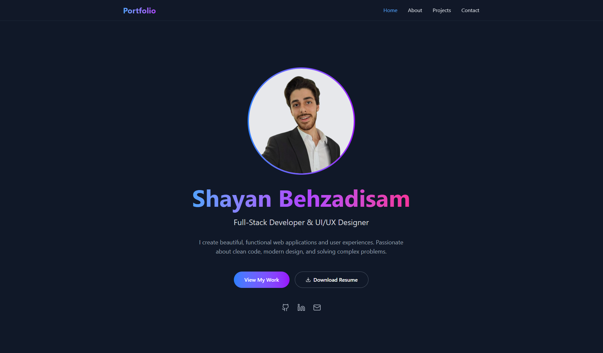

[](https://reactjs.org/)
[](https://vitejs.dev/)
[](https://tailwindcss.com/)
[](https://lucide.dev/)

# Portfolio Website
A modern, responsive portfolio website built with React.js, Vite, and Tailwind CSS. Showcases projects, skills, and contact information with a beautiful UI and smooth user experience.


## Table of Contents
- [Demo](#demo)
- [Features](#features)
- [Getting Started](#getting-started)
- [Folder Structure](#folder-structure)
- [Technologies Used](#technologies-used)
- [Contact](#contact)
- [License](#license)


## Demo

<!-- Add a GIF showing the main features of your portfolio here -->


<!-- Add a screenshot of your portfolio here -->



## Features
- Responsive design (mobile-first)
- Modern UI with Tailwind CSS
- Animated navigation and smooth scrolling
- Project cards with tech stack, code/demo links, and image handling
- Contact form with validation, Formspree integration, and popup modal
- Accessibility best practices
- Easy configuration for social/contact links
- Optimized images and performance


## Getting Started

### Prerequisites
- [Node.js](https://nodejs.org/) (v16+ recommended)
- [npm](https://www.npmjs.com/) or [yarn](https://yarnpkg.com/)

### Installation

```bash
# Clone the repository
git clone https://github.com/Arthur-001/portfolio-website.git
cd portfolio-website

# Install dependencies
npm install
# or
yarn install
```

### Running Locally

```bash
npm run dev
# or
yarn dev
```

The app will be available at [http://localhost:5173](http://localhost:5173)


## Folder Structure

```
🌐portfolio-website
├───📁src
│   ├───📁assets
│   │   ├───📁CV
│   │   ├───📁icons
│   │   └───📁images
│   │       ├───demoImage.png
│   │       ├───devIcon.png
│   │       ├───DirectoryTreeGenerator1.png
│   │       ├───huge_tree.png
│   │       ├───personalPhoto.jpg
│   │       └───smartcont.png
│   ├───📁components
│   │   ├───📁Button
│   │   ├───📁ContactForm
│   │   └───📁Navbar
│   ├───📁pages
│   │   └───portfolio.jsx
│   ├───📁styles
│   ├───App.css
│   ├───App.jsx
│   ├───index.css
│   └───main.jsx
├───.firebaserc
├───.gitignore
├───eslint.config.js
├───firebase.json
├───index.html
├───package-lock.json
├───package.json
├───postcss.config.js
├───README.md
├───tailwind.config.js
└───vite.config.js
```


## Technologies Used
- [React.js](https://reactjs.org/)
- [Vite](https://vitejs.dev/)
- [Tailwind CSS](https://tailwindcss.com/)
- [Lucide React Icons](https://lucide.dev/)
- [Formspree](https://formspree.io/) (for contact form)


## License

This project is licensed under the MIT License. See the [LICENSE](LICENSE) file for details.
